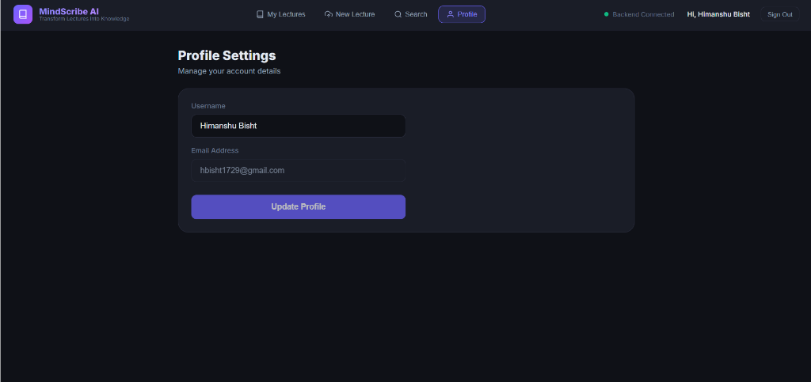
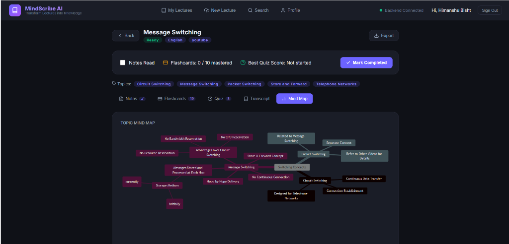
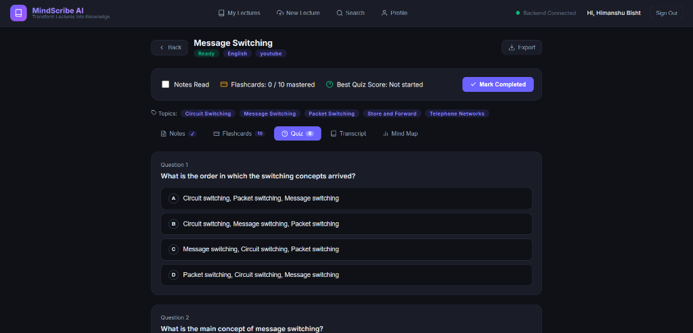
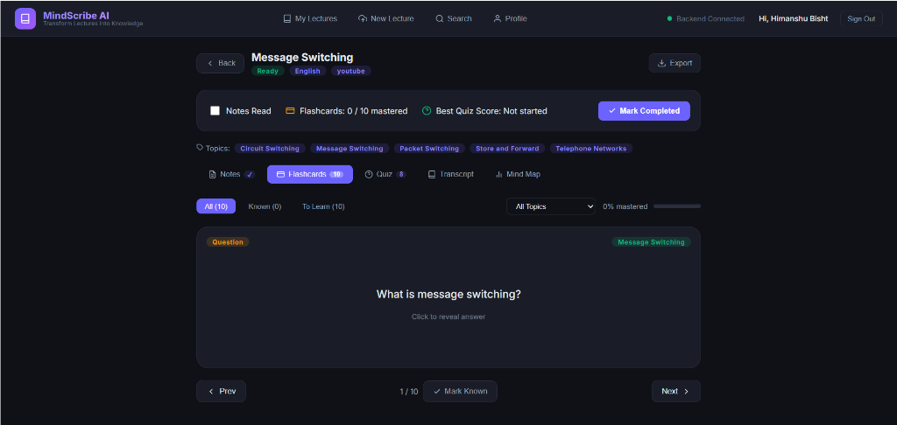

# MindScribe AI: Transform Lectures into Knowledge

MindScribe AI is a powerful web application that converts spoken lectures (audio files, video files, or YouTube links) into text using speech-to-text AI, and then transforms that content into clear study notes, mind maps, flashcards, and quizzes using Generative AI.

## Features

- **Upload & Transcribe:** Support for audio/video files and direct YouTube links.
- **Smart Notes:** Automatically structured, markdown-formatted study notes.
- **Mind Maps:** Visual representations of lecture topics using Mermaid.js.
- **Flashcards:** Interactive revision cards for key concepts.
- **Quizzes:** Auto-generated multiple-choice questions to test your knowledge.
- **Progress Tracking:** Keep track of what you've learned and your best quiz scores.
- **Export to PDF:** Save your notes and mind maps for offline reading.

## Screenshots

### Sign Up / Login


### Profile Settings


### Mind Map


### Lecture Notes


### Flashcards


### Quiz

## Tech Stack

- **Frontend:** React, Vite, Lucide Icons, Mermaid.js
- **Backend:** FastAPI, Python
- **AI / Processing:** Groq API (Llama 3), Whisper (local/API), YouTube Transcript API

## Getting Started

### Prerequisites
- Node.js (v18+)
- Python (3.9+)
- A Groq API Key

### Backend Setup

1. Open a terminal and navigate to the root directory.
2. Create a virtual environment:
   ```bash
   python -m venv venv
   ```
3. Activate the virtual environment:
   - Windows: `venv\Scripts\activate`
   - Mac/Linux: `source venv/bin/activate`
4. Install dependencies:
   ```bash
   pip install -r Requirements.txt
   ```
5. Create a `.env` file in the root directory and add your Groq API key:
   ```env
   GROQ_API_KEY=your_groq_api_key_here
   ```
6. Start the FastAPI server:
   ```bash
   cd backend
   uvicorn main:app --reload
   ```
   The backend will run at `http://localhost:8000`.

### Frontend Setup

1. Open a new terminal and navigate to the `frontend` folder:
   ```bash
   cd frontend
   ```
2. Install dependencies:
   ```bash
   npm install
   ```
3. Start the Vite development server:
   ```bash
   npm run dev
   ```
4. Open the displayed local URL (usually `http://localhost:5173`) in your browser.

## Deployment Notes

- **Backend:** Can be deployed to services like Render, Heroku, or Railway. Make sure to set the `GROQ_API_KEY` in the environment variables of your hosting provider. You will also need to configure CORS in `backend/main.py` if your frontend is hosted on a different domain.
- **Frontend:** Can be deployed to Vercel, Netlify, or GitHub Pages. The API base URL in `frontend/src/App.jsx` might need to be updated from `http://localhost:8000` to your production backend URL.
